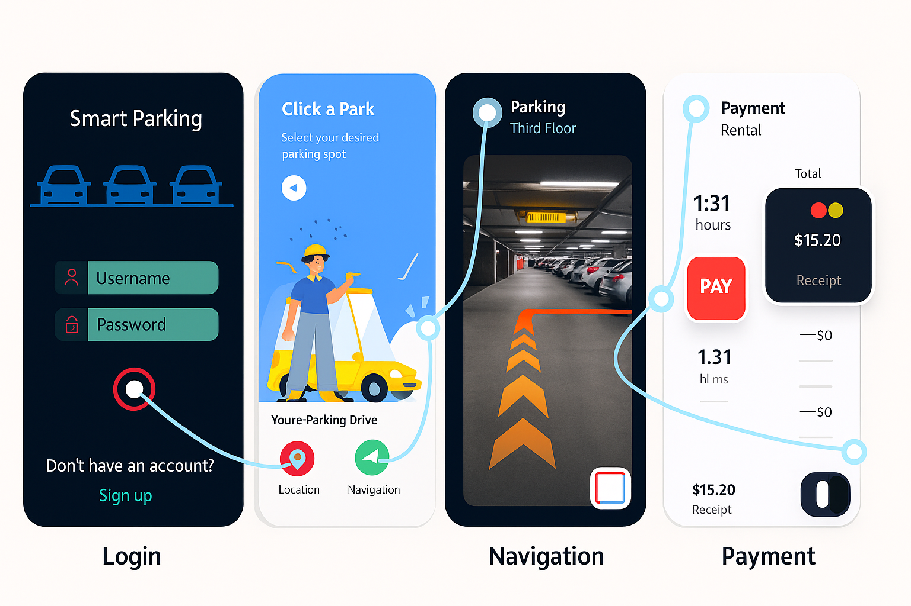

# Smart Parking System using Computer Vision and Machine Learning

This project proposes a computer vision-based smart parking system that identifies free and occupied parking spots in real-time using CCTV footage and a CNN model. The solution aims to reduce traffic congestion, parking-related delays, and fuel wastage.

## Overview

- Combines **Machine Learning**, **OpenCV**, and **CNN** to detect available parking slots.
- Real-time video analysis from **CCTV footage** to update parking availability.
- Includes a **Flask API** backend for live slot monitoring and a **mobile app** frontend for booking and payment.
- Focused on paperless digital payments and reducing congestion in urban areas.

## Tech Stack

- Python 3.8, OpenCV, Flask, YAML  
- CNN model trained on CCTV images  
- Microsoft Azure Cognitive Services Vision API  
- Firebase (Real-time DB), HTML/CSS/Jinja  
- React JS / Flutter (for frontend app)

## How It Works

1. User opens the app and searches for nearby parking.  
2. Live CCTV feed is processed via OpenCV.  
3. CNN identifies free and occupied parking spots using contour detection.  
4. Flask API sends updated slot information to the frontend.  
5. Users can book a slot, navigate to it, and make payments via the app.

## Features

- Real-time slot detection  
- Remote vehicle monitoring  
- Digital, paperless payment integration  
- User-friendly mobile interface  
- Dynamic navigation to selected parking slot

## 📱 App Interface Preview

Smart parking app prototype:

## Challenges

- Integrating real-time video feed to the backend.  
- Ensuring API and model robustness in live settings.  
- Balancing cost and reliability of cloud services and infrastructure.

## Future Work

- Integrating sensor data to improve prediction accuracy.  
- Deploying the solution to cloud infrastructure.  
- Expanding to support larger-scale parking infrastructure with multi-level parking analytics.
